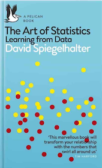
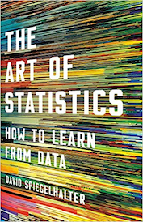
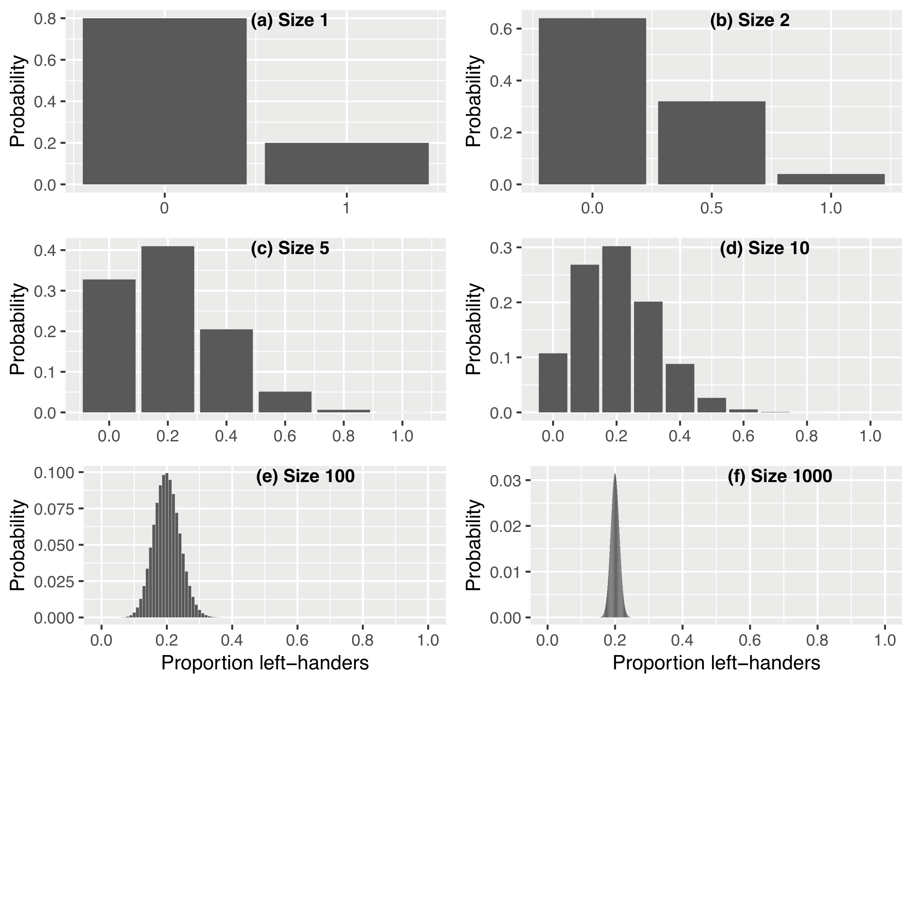

# The Art of Statistics: Code, Data, Errata and Additions

UK hardback:  UK paperback: 
US hardback: 

Here is the book’s [UK Amazon
page](https://www.amazon.co.uk/Art-Statistics-Learning-Pelican-Books/dp/0241398630)
and [US Amazon
page](https://www.amazon.com/Art-Statistics-How-Learn-Data/dp/1541618513/ref=sr_1_2?keywords=spiegelhalter&qid=1564306871&s=gateway&sr=8-2)

The UK and US hardback versions are identical in content. Errata and
additions are listed below for all versions.

This file is produced by R Markdown, and there is also a
[web-page](https://dspiegel29.github.io/ArtofStatistics/) produced by
Github.

## Code repository

The [repository](https://github.com/dspiegel29/ArtofStatistics) contains
data and R code for the Figures and Tables in Art of Statistics. They
should all work in RStudio.

  - It is not yet complete, and will change and improve.

  - The graphics were originally mainly produced in basic R, but (with
    much appreciated assistance) these have been mainly revised into
    ggplot2 - sometimes both versions are provided for comparison.
    However I do not pretend to have any particular skill in using R or
    ggplot, and no doubt many improvements could be made.

  - Many packages are used and will need to be installed, for example
    using install.packages(“ggplot2”)

  - While the individual files can be downloaded, it is probably easiest
    to download a zipped repository using the green download button.

Suggestions for improvements to
    <david@statslab.cam.ac.uk>

### Markdown output for individual Figures

  - [00-1-age-and-year-of-deathofharold-shipmans-victims](https://dspiegel29.github.io/ArtofStatistics/00-1-age-and-year-of-deathofharold-shipmans-victims/00-1-age-year-shipman_victims-x.html)
  - [00-2-shipman-times](https://dspiegel29.github.io/ArtofStatistics/00-2-shipman-times/00-2-shipman-times-x.html)
  - [01-1-2-3-child-heart-survival-times](https://dspiegel29.github.io/ArtofStatistics/01-1-2-3-child-heart-survival-times/01-3-child-heart-proportions-x.html)
  - [01-1-2-3-child-heart-survival-times](https://dspiegel29.github.io/ArtofStatistics/01-1-2-3-child-heart-survival-times/01-1-child-heart-survival-x.html)
  - [02-2-3-jelly-bean-counts](https://dspiegel29.github.io/ArtofStatistics/02-2-3-jelly-bean-counts/02-2-3-jelly-beans-count-x.html)
  - [02-4-reported-partners](https://dspiegel29.github.io/ArtofStatistics/02-4-reported-partners/02-4-sexual-partners-x.html)
  - [02-5-survival-vs-numbers](https://dspiegel29.github.io/ArtofStatistics/02-5-survival-vs-numbers/02-5-child-heart-surgery-x.html)
  - [02-6-zero-correlations](https://dspiegel29.github.io/ArtofStatistics/02-6-zero-correlations/02-6-zero-correlations-x.html)
  - [02-7-population-trends](https://dspiegel29.github.io/ArtofStatistics/02-7-population-trends/02-7-population-history-x.html)
  - [02-8-relative-population-increase](https://dspiegel29.github.io/ArtofStatistics/02-8-relative-population-increase/02-8-relative-population-increase-x.html)
  - [03-2-birth-weights](https://dspiegel29.github.io/ArtofStatistics/03-2-birth-weights/03-2-birthweights-old-x.html)
  - [05-1-sons-fathers-heights](https://dspiegel29.github.io/ArtofStatistics/05-1-sons-fathers-heights/05-1-galton-heights-x.html)
  - [05-2-logistic-child-heart](https://dspiegel29.github.io/ArtofStatistics/05-2-logistic-child-heart/05-2-logistic-child-heart-x.html)
  - [07-1-2-3-distributions-of-partners+bootstrap](https://dspiegel29.github.io/ArtofStatistics/07-1-2-3-distributions-of-partners+bootstrap/07-1-2-3-partners-bootstrap-x.html)
  - [07-4-mother-daughter-bootstrap](https://dspiegel29.github.io/ArtofStatistics/07-4-mother-daughter-bootstrap/07-4-mother-daughter-bootstrap-x.html)
  - [08-1-chevalier-de-mere](https://dspiegel29.github.io/ArtofStatistics/08-1-chevalier-de-mere/08-1-mere-simulation-x.html)
  - [08-5-observed-expected-homicides](https://dspiegel29.github.io/ArtofStatistics/08-5-observed-expected-homicides/08-5-observed-expected-homicides-x.html)
  - [09-1-left-handers](https://dspiegel29.github.io/ArtofStatistics/09-1-left-handers/09-1-left-hander-binomial-x.html)
  - [09-2-funnel-bowel-cancer](https://dspiegel29.github.io/ArtofStatistics/09-2-funnel-bowel-cancer/09-2-bowel-funnel-x.html)
  - [09-4-homicide-rates-E+W](https://dspiegel29.github.io/ArtofStatistics/09-4-homicide-rates-E+W/09-4-homicide-trends-x.html)
  - [10-1-sex-ratio](https://dspiegel29.github.io/ArtofStatistics/10-1-sex-ratio/10-1-sex-ratio-x.html)
  - [10-2-permutation-test-arm-crossing](https://dspiegel29.github.io/ArtofStatistics/10-2-permutation-test-arm-crossing/10-2-arms-data-permutation-test-x.html)
  - [10-3-4-Shipman-cumulative-frequency-and-SPRT](https://dspiegel29.github.io/ArtofStatistics/10-3-4-Shipman-cumulative-frequency-and-SPRT/10-3-4-shipman-sprt-x.html)

## Errata and additions - Paperback

Many apologies that errors are still there (sob).

 - page xiv	list of tables	Delete the entry "12.1 Questionable Interpretation and Communication Practices 354"
 - page 146	para 3, line 4, 	replace "dislikes" by "reactions"
 - page 150	legend to Figure 6.1	replace "to a Francis William Somerton" by "to a William Henry Somerton"   
 - page 172	line -1. 	replace 'selects relevant'  by 'eliminates unnecessary'
 - page 179	para 2, line 5	replace "When a vision algorithm was trained to discriminate pictures of huskies from German Shepherds, it was very effective until it failed on huskies that were kept as pets – it turned out that its apparent skill was based on identifying snow in the background" by "A vision algorithm intended to discriminate pictures of huskies from wolves was (deliberately) trained on images of wolves in snow and huskies without snow, with the result that any future image of either dog was classified as a wolf if there was snow in the background"
 - page 182	line 12	“Communicated” -> “communicated” (small “c”)
 - page 183	Table 6.5, line 5	replace "Trastuzamab" by "Trastuzumab" 
 - page 191	line -1	it should read "there were 1,215"..
 - page 221	line 10	“quantity” -> “number”
 - page 223	line 13	“driven” -> “that can be modelled”
 - page 249	para 2, line -2	Put single quotes around "confident"
 - page 265	line 3, 	replace "null distribution"  by "distribution of the observed difference, were the null hypothesis true"
 - page 272	legend to Table 10.3, line 2	replace '2014' by '2013'
  - page 286 line 6. Add ‘1 -’ in front of

 - page 286 line -7. Add ‘1 -’ in front of

- page 322	lines -6, -8, -11	Replace "royal" by "straight" in three places
 - page 346	line -11	before "two groups", add "the changes in" 
  - page 396 Pearson Correlation Coefficient. The formula is missing a
    square root sign in the denominator, and should read  
    

  - page 396 Pearson Correlation Coefficient. Add
    
    before 

  - page 396 Pearson Correlation Coefficient. Add after ‘Z-scores’
    ‘(this assumes the standard deviations have been calculated with
      in the denominator:
    if  has been
    used, the formula is  
    

 - page 409	note 5 	replace "https://esa.un.org/unpd/wpp/Download/Standard/Population/" by "https://population.un.org/wpp/Download/Standard/Population/"
 - page 413	note 4	replace with "https://www.kdd.org/kdd2016/papers/files/rfp0573-ribeiroA.pdf"

 

## Errata and additions - Hardbacks

##### (these should now all be corrected in the paperback)

  - page 26 Figure 1.1 At the end of the legend, add ‘Rather than a
    bar-chart, it may be better to use dots for the data-points when the
    axis does not start at zero.’
  - page 49 Footnote. ‘31,337’ was probably a deliberate choice by an
    ageing geek, as it was an old expression for [‘eleet /
    elite’](https://www.urbandictionary.com/define.php?term=31337)
  - page 59 Legend for Figure 2.6, replace ‘Alberto Cairo’s’ by ‘the’
  - page 71 line 2, add ‘before having their first child’  
  - page 86 line -9. ‘2,190’ should read ‘2,910’
  - page 110 The ‘M’ in STEM should be ‘Mathematics’ and not ‘Medicine’
  - page 156 line 9. ‘large’ should be ‘smaller’
  - page 159, 161 The question on page 161 should be before the last two
    lines on page 159.
  - pages 191 to 200 - see below
  - page 206, header says ‘Chapter 7’, should be ‘Chapter 8’
  - page 212 Figure 8.3 – the label ‘Head’ on the first lower branch
    should be ‘Tail’
  - page 222, line -3, ‘2014’ should be ‘2013’
  - page 225 legend to Figure 8.5, ‘2014’ should be ‘2013’
  - page 232. Figure 9.1b is incorrect - the bars should have heights
    0.32, 0.64, 0.04, as described in the footnote. Figures 9.1e and
    9.1f are incorrect, the peak should be centred at 0.2, and 9.1e has
    an apparent layer of probability smeared over the whole range. The
    correct version of Figure 9.1 is shown below, and can be found on
    the Github repository 
  - page 235 Legend to Figure 9.2, line 2, after ‘UK’, add ‘(except
    Wales)’
  - page 254 In the legend to Figure 10.1 ‘solid’ should be replaced by
    ‘dashed’
  - page 286 lines -7,-6. alpha and beta should not be italicised.
  - page 306 para 3, line 4, replace ‘gender’ by ‘sex’
  - page 319 Table 1 last line, replace ‘6.5’ by ‘6.7’
  - page 319 Table 1 legend, replace ‘6.5’ by ‘6.7’
  - page 319 Table 1 legend, after ‘individual’ add ‘(unrounded)’
  - page 324 line 4, ‘down’ should be ‘up’
  - Page 342, start of the last paragraph,‘Ioannadis’ is misspelled
    (having spelt it correctly as ’Ioannidis’at the start of the
    previous paragraph )
  - page 375 Headings of Table 13.1. ‘O’ in ‘Others’ is printed as a
    zero rather than an ‘O’
  - page 409 Footnote 4, insert at start ’ Data are from the ‘Datasaurus
    Dozen’, <https://www.autodeskresearch.com/publications/samestats>,
    which includes ’
  - page 416 Note 7 ends with ‘p.000’, which should be ‘p.92’

The bootstrap analysis in Chapter 7 contained some errors which have
been corrected in the version on Github, where the analysis is clarified
by using only data on men reporting less than 50 partners. Corresponding
edits to the text are shown below.

  - page 191 line -1. “1,100” should be “1,125”
  - page 192 line 1. “796” should be “806”
  - page 192 para 2, line 5. “of their responses” should be “for the 760
    men who reported up to 50 partners.”
  - page 192 para 2, line 6. “796” should be “760”
  - page 192 para 2, line -4. “high” should be “low”
  - page 192 para 2, line -4. “21.1” should be “8.3”
  - page 192 para 2, line -1. “796” should be “760”
  - page 193 replace Figure 7.1 by the corrected version on the Github
    repository  
  - page 193 Legend to Figure 7.1: replace “796” should be “760”
  - page 194 Table 7.1. Size: replace “796” should be “760”
  - page 194 Table 7.1. Mean number of partners: replace by “8.3, 10.5,
    12.2, 11.4”
  - page 194 Table 7.1. Median number of partners: replace by “9, 7.5,
    8, 7”
  - page 194 Table 7.1. Legend: “796” should be “760”
  - page 195 line 3, replace “15” by “11.4”
  - page 195 para 2, line 5. “796” should be “760”
  - page 196 replace Figure 7.2 by the corrected version on the Github
    repository  
  - page 196 Legend to Figure 7.2: replace everything after “For
    example,” with “25 partners occurs once in the original data. This
    data-point was not sampled in the first or second bootstrap sample,
    but was sampled twice in the third.”
  - page 197 para 1, line 2, replace “18.8” by “10.5”
  - page 197 para 1, line 5, replace “14.5” by “8.4”
  - page 197 para 1, line 5, after “8.4”, add footnote ’\*’
  - page 197 para 1, line -1, replace “14.5, 26.5 and 22.5” by “8.4, 9.7
    and 9.8”
  - page 197 add footnote ‘\* Think of a bag of 50 balls, each labelled
    as one data-point from our sample of 50; for example, one would be
    labelled ‘25’, two would be labelled ‘30’, and so on. We pick one
    ball at random from the bag, record its value, and then replace it,
    restoring the number of balls in the bag to 50. We repeat this
    process of picking, recording and replacing a total of 50 times,
    producing a distribution of data-points such as “Boot 1”.’
  - page 198 replace Figure 7.3 by the corrected version on the Github
    repository  
  - page 198 Legend to Figure 7.3: replace “796” should be “760”
  - page 199 para 2, line 3, after “contains” add “the central”
  - page 200 Table 7.2. Mean number of partners: replace by “8.3, 10.5,
    12.2, 11.4”
  - page 200 Table 7.2. 95% bootstrap intervals: replace by “5.3 to
    11.5, 7.7 to 13.8, 10.5 to 13.8, 10.5 to 12.2”
  - page 200 Table 7.2. Legend: “796” should be “760”
